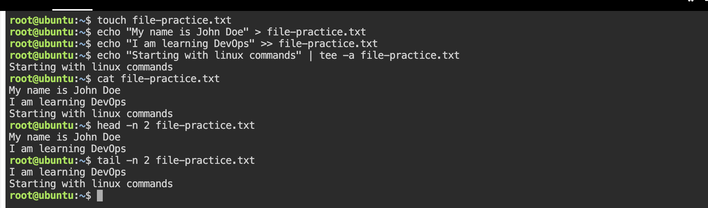

# 📁 Day 06 — Read & Write Text Files in Linux

> **Topic:** File I/O Operations — creating, writing, appending, reading files in Linux

---
## 📑 Table of Contents
- [Commands](#Commands)
- [Features](#features)
- [Screenshots](#screenshots)
- [Future Improvements](#future-improvements)
---

## 🛠 Commands

### 1. Create a file — `echo` with `>`

```bash
echo "Hello world!" > notes.txt
```

| Part | Meaning |
|------|---------|
| `echo` | Prints the given text to the terminal |
| `"..."` | The text/string to write |
| `>` | **Redirect** — writes output to a file. ⚠️ Overwrites if file already exists |
| `notes.txt` | The target file (created automatically if it doesn't exist) |

---

### 2. Append to a file — `>>`

```bash
echo "I'm DevOps enthusiast." >> notes.txt
echo "Today is the Day 06 of 90DaysOfDevOps challenge" >> notes.txt
```

| Part | Meaning |
|------|---------|
| `>>` | **Append redirect** — adds to end of file without overwriting existing content |

> 💡 **`>` vs `>>`** — `>` destroys existing content, `>>` preserves it and adds below.

---

### 3. Read a file — `cat`

```bash
cat notes.txt
```

Prints the **entire file** content to the terminal at once.

---

### 4. Read first N lines — `head`

```bash
head -n 2 notes.txt
```

| Flag | Meaning |
|------|---------|
| `-n 2` | Show only the first 2 lines of the file |

**Output:**
```
Hello, My name is vaibhav godse.
I'm DevOps enthusiast.
```

---

### 5. Read last N lines — `tail`

```bash
tail -n 2 notes.txt
```

| Flag | Meaning |
|------|---------|
| `-n 2` | Show only the last 2 lines of the file |

**Output:**
```
I'm DevOps enthusiast.
Today is the Day 06 of 90DaysOfDevOps challenge
```

> 💡 **DevOps use case:** `tail -f /var/log/syslog` — follow a log file live during deployments.

---

### 6. Write using `tee`

```bash
echo "Testing the 'tee' command" | tee -a notes.txt
```

| Part | Meaning |
|------|---------|
| `\|` | Pipe — sends output of `echo` into `tee` |
| `tee` | Writes to a file **AND** prints to the terminal simultaneously |
| `-a` | Append mode — same as `>>`, doesn't overwrite |

> 💡 **Why `tee` over `>>`?**
> `>>` only writes to file silently. `tee` writes to file **and** shows output on screen at the same time — useful in scripts where you want to log AND see what's happening.

---

## 💻 Hands-On



### Final state of `notes.txt` after all commands:

```bash
cat notes.txt
```

```
My name is John Doe
I am learning DevOps
Starting with linux commands
```

---

## 🔍 Key Differences

| Operator | Action | Overwrites? | Shows on terminal? |
|----------|--------|-------------|-------------------|
| `>`      | Write to file | ✅ Yes | ❌ No |
| `>>`     | Append to file | ❌ No | ❌ No |
| `tee`    | Write to file | ✅ Yes (default) | ✅ Yes |
| `tee -a` | Append to file | ❌ No | ✅ Yes |

---

## 📋 Quick Reference

| Command | What It Does |
|---------|-------------|
| `echo "text" > file.txt` | Create/overwrite file with text |
| `echo "text" >> file.txt` | Append text to existing file |
| `cat file.txt` | Read entire file |
| `head -n N file.txt` | Read first N lines |
| `tail -n N file.txt` | Read last N lines |
| `tail -f file.txt` | Follow file live (great for logs) |
| `echo "text" \| tee -a file.txt` | Append + print to terminal simultaneously |

---
